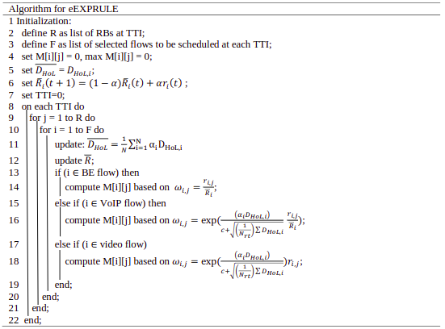

# Enhanced exponential rule scheduling algorithm for real-time traffic in LTE network

## Preamble
This is an implementation of the algorithm used for QoS improvement as described in our paper [Enhanced exponential rule scheduling algorithm for real-time traffic in LTE network](http://doi.org/10.11591/ijece.v10i2.pp1993-2002). 

## How the Algorithm works
The  proposed  eEXPRULE  try  to  reduce  the  head-of-line  delay  by  computing  the  transmission metric  for  each  traffic separately,  which  leads  to  an  increment in the UE’s throughput. 

## Reference
<a id="1">[1]</a>
Giuseppe Piro, Luigi Alfredo Grieco, Gennaro Boggia, Francesco Capozzi, and Pietro Camarda  (2011).
Simulating LTE Cellular Systems: an Open Source Framework, IEEE Trans. Veh. Technol., vol. 60, no. 2, Feb, 2011, doi: 10.1109/TVT.2010.2091660

<a id="1">[2]</a>
https://github.com/lte-sim

If you found this code useful, please cite our paper:

    @article{wu2019breastcancer, 
        title = {Enhanced exponential rule scheduling algorithm for real-time traffic in LTE network},
        author = {Yaghoubi JIA Yaqoob, W. L. Pang, S. K. Wong, K. Y. Chan}, 
        journal = {Internatinal Journal of Electrical and Computer Engineering (IJECE)},
        year = {2020}
    }